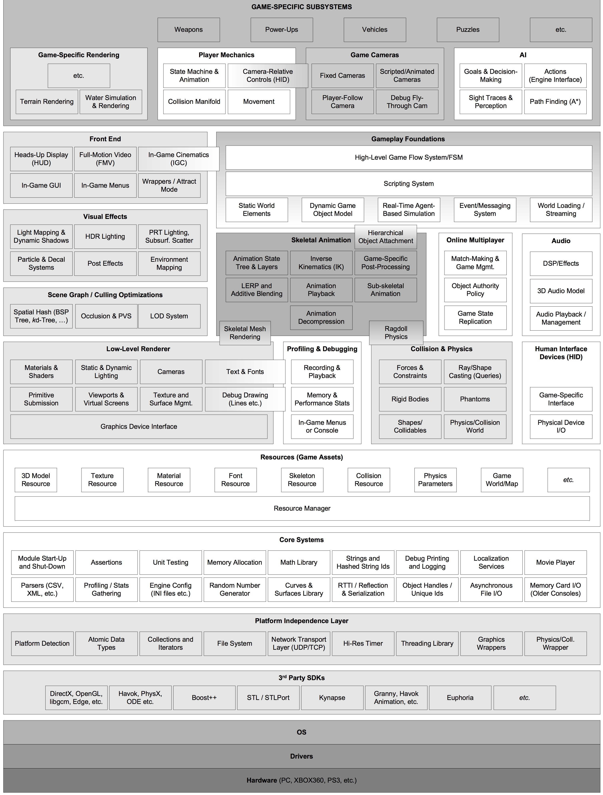

# Organisatorisches

> - Das bin ich:
> - Sebastian Mendez, Master Informatik Student am KIT
> - Lieblingsessen: Pizza

<!--- TODO: Joke about Venezuela? -->

----------------------------

## Termine

17 Unterrichtseinheiten; 1 UE = 2.5 St

- Mai: 12.5. & 18.5. & 19.5. & 26.5.
- Juni: 1.6. & 2.6. & 8.6. & 15.6.

Jeweils von 9:00 Uhr bis 14:00 Uhr.

Kontakt: sebastian.siem@student.kit.edu || sebas.chinoir@gmail.com

# Ziel:

GAMES!!!

<!-- TODO: Foto -->

----------------------------

## Ok...eher Graphics

<!-- TODO -->

----------------------------

## Was ist ein Game/Graphics Engine?

---------------------------

<!-- TODO Pictures of Game Engs -->

---------------------------

## Was ist dann ein Game/Graphics Engine?

**¯\\_(ツ)_/¯**

---------------------------

> - Genre spezifisch
> - Hat Tools (oder auch nicht)
> - Teil des Spiels (oder auch nicht)
> - **Wiederverwendbar**
> - **Erweiterbar**

--------------------------

Nach Jason Gregory:

-------------------------

<!-- TODO: Picture of window -->

# Inhalt

* WinAPI oder: Wie ich lernte, Windows zu "lieben"
    + WinMain
	+ MessagePump
	+ Libraries
	+ Windows Apps

* OpenGL
	+ Welches OpenGL?
	+ Init und Contexts, ohne dass dein Rechner explodiert
	    - (Wo versteckt sich mein GPU?)
	+ Viewport und Rendertargets

-------------------------

* Rendering Pipeline
	+ Figuren im Raum (in welchem Raum?)
	+ Transformationsmatrizen
	    + Achtung: Mathe (ﾉ´ヮ´)ﾉ*:･ﾟ✧
	+ Pipeline

* Shaders
	+ GLSL
	+ Vertex & Fragment Shader
	+ (Theorie der Beleuchtung: Phong, et al.)
	+ Brauchen wir Schatten?

-------------------------

* Materials!
    + Texturen
	+ Normal- und Bump Maps: billig und gut

* Modelldaten laden
	+ Problematische Formate
	+ Memory kills the game
	  - (Cache und Data Driven Programming)
	+ (Streamen)
	+ Sprites

-------------------------

* Graphische Probleme und "Lösungen"
	+ Filtering
	+ Beleuchtung
	+ Deferred Shading
	+ Post-Processing

* Nicht nur Graphics
    + Input Devices
		- RawInputDevice
		- Abstraktion
		- Portabilität
	+ Game Loop
		- Andere Subsysteme kaputt machen
		- Dein Ticker ist falsch

-------------------------

* Extras (auf Wunsch):
    + Moar FPS!!!
	+ Globale Beleuchtung
	+ Prozedural-Generiertes: Nur für Faulen
	+ Mehr Schatten
	+ ...
